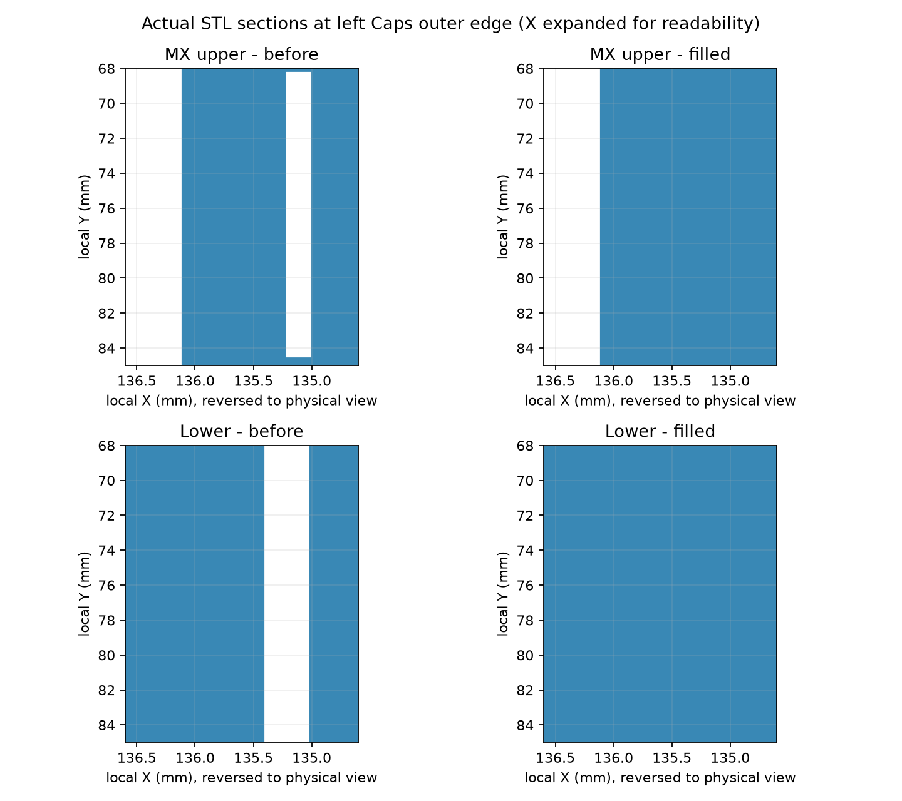

# Same-body wall slit correction

Requirements: CON-ARCH-006, OPS-ARCH-006. Baseline Git revision:
`83ae5fcd998d95eea55aac33d42069e62d7d2aab`.

The former upper rim was clipped to a band too far from the original stock.
At the left Caps outer edge this left an approximately 0.20 mm x 16.25 mm
same-body slit. Similar upper slits and approximately 0.40 mm lower stock-to-wall
gaps were present elsewhere. These are distinct from the intentional 0.30 mm
upper/lower fitting clearance and right A/B print separation.

This comparison uses the baseline Fusion-reexported STL and the candidate STL
exported from the corrected, reopened Fusion archive. The horizontal scale is
expanded to make the narrow gap visible; this is a section comparison, not a
whole-assembly or physical-strength approval.

The correction adds local material; it does not subtract existing stock or
introduce the withdrawn screwless clip. The planner limits closure to narrow
same-body gaps in the perimeter band, subtracts explicit functional exclusion
regions, and respects per-body ownership. Lower additions stop at the existing
PCB support plane. Upper additions follow the original layer heights.

Right lower split-end coordinates extracted from STL required bounded precision
normalization before CAD union: a 0.0001 mm grid, at most 0.00008 mm Hausdorff
movement, and at most 0.05 mm2 changed patch area. Effective patch polygons and
measured errors are recorded in each affected generation record. The original
candidate plan is retained. Missing material is a failure, not waived as a
mesh or kernel artifact. Native/STL review checks the effective polygons.

The first full mesh review rejected the three right upper A/B gaps: the binary
STL projection measured 0.399894714 mm against the 0.3999 mm CAD threshold.
The initial failure is retained as `evidence/review-initial.json`. A separate
Fusion minimum-distance measurement reopens the actual F3D bodies. Acceptance
requires the CAD gap to meet 0.3999 mm (1e-7 mm kernel allowance), zero projected
overlap, and mesh/CAD disagreement no larger than the calculated binary-float32
coordinate rounding bound. Real CAD shortfalls and larger mesh differences are
rejected by regression tests; a blanket looser fit tolerance is not used.

## Evidence and limits

Published digital result: PASS. Ten CAD models, ten reopened real Fusion
archives and fifteen STL files are updated at the canonical model root.
Twenty-seven regression tests pass. All 123 checked fill/protection sections
report zero missing required area, zero protected-region obstruction and zero
off-plan added area. Twelve vertical assembly sweeps and six horizontal joined
assembly sweeps report zero overlap. Five A/B pairs pass source-CAD-backed
clearance checks. All sixteen ordered PCB/Gerber files remain byte-identical.
The portable publication verifier passes for all 35 CAD output files and their
source/evidence bindings. These are digital results, not physical qualification.

Publication is complete only when the canonical
`hardware/MODELS/kc2_wall_gap_fix_manifest.json` exists and its read-only verifier
passes. The `evidence` directory then contains the plan, ten CAD generation
records, ten real Fusion import/archive/reopen/native-STL records, actual STL
section/motion review, and test results. Do not infer completion from this text.

CAD Boolean checks require zero removed baseline material and zero unplanned
addition within stated kernel tolerances. Mesh checks independently inspect the
required fill at three heights per patch, functional exclusion regions, mm
units, topology and print envelope. Motion checks use actual prismatic mesh
layers for vertical upper insertion and full projections for right A/B and
left/right approach. Native output is made by Fusion, not renamed STEP files.

The PCB/Gerber hashes remain those of the previously ordered release.
Actual PLA+ strength, fatigue, manufacturing tolerance and populated physical
fit remain unqualified. No SRS criterion is marked physically verified here.

## Reproduction

Use an isolated checkout at the baseline above; bring the four new gap-fix tools,
their tests and `tools/fusion/KC2WallGapFix.py` from this revision into it. Do not
run the additive producer against already-corrected canonical models.

1. `python -B -m unittest tools.test_kc2_wall_gap_fix`
2. `python -B -m tools.kc2_wall_gap_fix plan`
3. Run `python -B -m tools.kc2_wall_gap_fix left:mx` and each of the other nine
   side/kind jobs: left/right with normal, magnetic, mx, choc_v1, deep_sea.
   For the two right lower jobs use
   `python -B -m tools.build_kc2_wall_gap_precision right:normal` and
   `python -B -m tools.build_kc2_wall_gap_precision right:magnetic` to apply the
   explicitly recorded precision normalization.
4. In Fusion's Python console load `tools/fusion/KC2WallGapFix.py`, set its `ROOT`
   and `STAGE` to the isolated checkout, and invoke `run()`. Explicit subsets
   can be supplied as a list; all ten records must pass before publication.
   Also run `tools/fusion/KC2WallGapClearance.py` for source-bound exact A/B
   measurements of all five right-side native archives.
5. Run `python -B -m tools.review_kc2_wall_gap_fix`, and the test modules recorded
   in `evidence/tests.json`. Generate a fresh test result record from the actual
   run; do not copy an old success record to approve changed sources.
6. Only after all checks pass, publish with
   `python -B -m tools.publish_kc2_wall_gap_fix --publish`.

For an already published checkout, run without `--publish`. Historical baseline
model bytes are read from Git; the read-only verifier does not require staging
directories or a live Fusion process.
